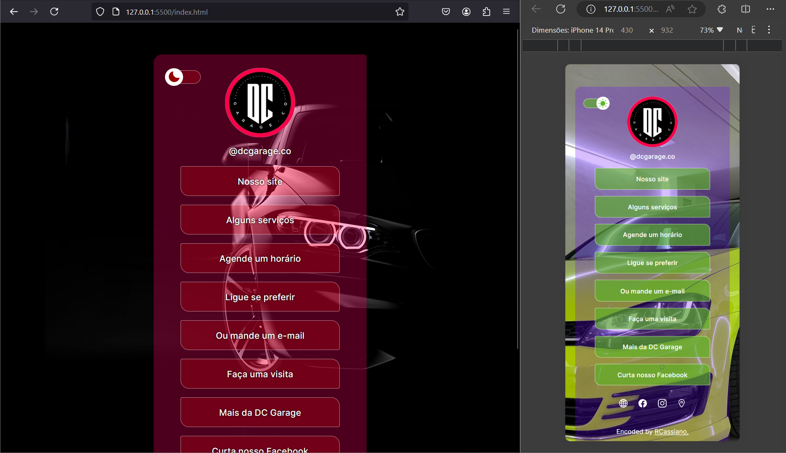

<h1 align="center"> DC Garage | Links< </h1>

Treinamento prático com projeto de Links/ "Cartão de visitas", concentrando os meios de comunicação da empresa com o cliente final.

  <a href="#-tecnologias">Tecnologias</a>&nbsp;&nbsp;&nbsp;|&nbsp;&nbsp;&nbsp;
  <a href="#-projeto">Projeto</a>&nbsp;&nbsp;&nbsp;|&nbsp;&nbsp;&nbsp;
  <a href="#-layout-base">Layout</a>&nbsp;&nbsp;&nbsp;|&nbsp;&nbsp;&nbsp;
  <a href="#memo-licença">Licença</a>

  

 

  

## 🚀 Tecnologias

Esse projeto foi desenvolvido com as seguintes tecnologias:

- HTML e CSS
- JavaScript
- Git e Github
- Figma

## 💻 Projeto

O "DC Garage | Links<" é um agregador de links para usar como cartão de visitas online e facilitar a comunicação do cliente com a empresa.

## 🔖 Layout-base

Você pode visualizar o layout base do projeto através [DESSE LINK](https://www.figma.com/community/file/1187422022288947321/duplicate). É necessário ter conta no [Figma](https://figma.com) para acessá-lo.

## :memo: Licença

Esse projeto está sob a [licença MIT](https://github.com/remy/mit-license).

---

Projeto base, feito com ♥ by Rocketseat :wave: [Participe da nossa comunidade!](https://discord.gg/rocketseat)
